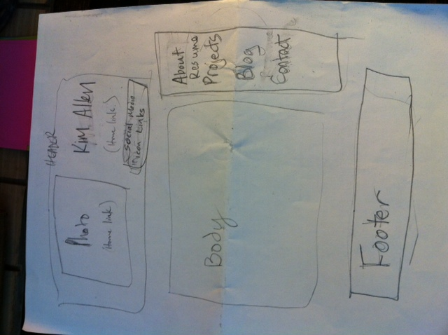
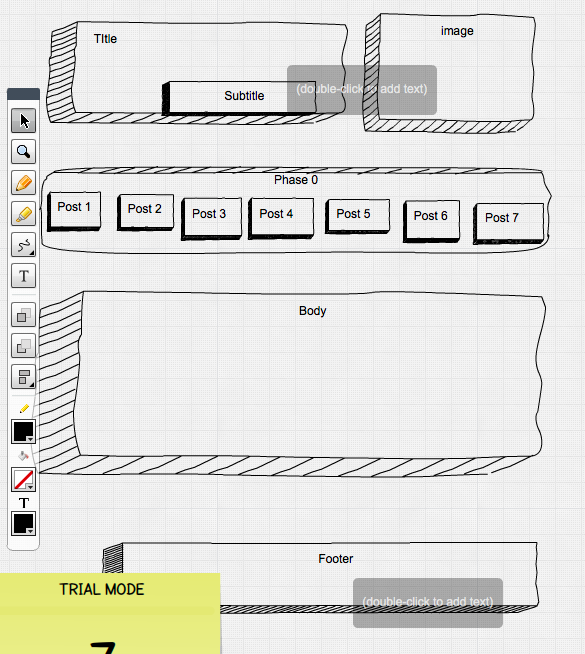

What is a wireframe?
A wireframe is a simple skeleton to show a general layout of a web page. It's like making a visual outline without all the detail.  Usually it is in black and white.
What are the benefits of wireframing?
Wireframing allows the designer to get a visual on the layout without the distraction of color, images, etc.  They are easy to adjust to try out different layouts.
Did you enjoy wireframing your site?
I found it challenging because i wanted to be creative yet creativity seems limited because of the need to have readability and hierarchy.  I also have only started thinking about a personal site, so it's hard to imagine it.
Did you revise your wireframe or stick with your first idea?
I mostly stuck with my original idea just so I could practice getting something down.
What questions did you ask during this challenge? What resources did you find to help you answer them?
I wondered whether it would be more efficient to draw on paper or to use one of the programs. I tried out both methods.  I realize that editing and changing things around is easier with a digital drawing or representation.  I was more hesitant to try different versions with my drawing because I had to either erase or use more paper.  Possibly sticky notes would work well instead.  I went back to review the Beginner's Guide to Wireframing to see if  I was doing it right.  I wasn't sure how much detail to go into.
Which parts of the challenge did you enjoy and which parts did you find tedious?
I get a bit stressed over the idea of this being the beginning of something that will be accessible to all eyes online.  I find that I'm wanting to be creative, yet get stuck with feeling like every decision is vital.  This is exactly why sketching and wireframing are an important way for me to start designing since it is just a sketch.  It was also a bit tedious trying to choose a computer version for creating the wireframe and then trying to learn how to use that method.  I didn't find anything particularly enjoyable about it since I'm on a time crunch to finish it.  